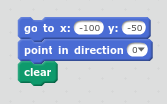
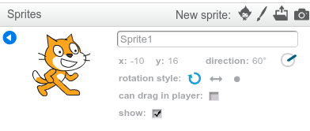
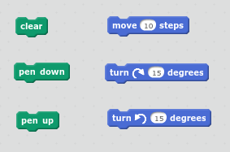
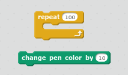
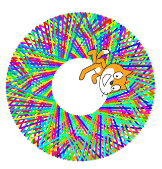

% KS2
% programming, drawing, scratch
%

# Draw your initial with Scratch

Scratch is an excellent choice for a first programming language. It's free,
widely used, and you can use it to teach all the core concepts.

It was developed by MIT, and has been in use for over a decade. Scratch 2 has
been released in the last few years, and includes social tools for sharing your
programs.

Scratch has a low floor and a high ceiling - it's easy to get started, but you
can go a very long way with it. It's not just for games and presentations, you
can build complex programs, and even solve real world problems with it.

A nice introduction to Scratch is using the pen tools. These let you draw like
you may be used to using Logo, Turtle or Beebots.

# Preparation

Make sure scratch is working on the computers you plan to use. This activity can
be done with Scratch 1 or 2. Screenshots will be shown from Scratch 2.

It's nice to first re-visit the [Robot Game](robot.md) as this puts your young
programmers in the mind of having to navigate looking down on the robot. If you
play the robot game, then draw attention to the need for the robot to always
start in the same place, and with the same direction.

Get paper and pens ready.

# Method

## Solving the problem on paper

Ask the children to first draw their initial on a piece of paper. If they have
curves in their initial, ask them to simplify it by using straight lines.

Ask them to choose a starting point, and to mark it with a circle.

Ask them to consider each of the straight lines that a robot would have to move
to draw their initial if it had a pen sticking out of it.

Ask if they'd need any new commands from the robot game. For example, if their initial has multiple lines, like a T, either they can go back the way
they came, or they might want to create a `pen up` and `pen down` command.

Ask them to write out the codes they'd need to draw their initial just as they'd
done for the robot game.

    start
    forward 100
    right 135
    forward 50
    left 90
    forward 50
    right 135
    forward 100
    end

## Moving to Scratch

### A good starting point

When we played the robot game, we always started in the same place and pointed
in the same direction. If we were always starting in a different place our
program would have to change every time. So to start off, we need the scratch
codes that are equivalent to our `start` command.

Each child will need to set the x and y co-ordinates to where they want Scratch
to start from. And depending on their initial the direction will be different
too.

Now we can move Scratch the cat anywhere, and point him in different directions,
and every time we click these blocks he'll go back to the start and the screen
will be wiped.

Here's how you make Scratch point in different directions on Scratch 2.

## Build the initial, line by line

Now we have a guaranteed starting point, each child can use the move and pen
blocks to build their initial.

It's best to write a program piece by piece, testing after each new bit. That
way it's easier to spot bugs. 

When we played the robot game it was easy to see where the errors were, because
things happened so slowly. Computers run so fast that sometimes it's hard to see
where the problems are. So another way to test is to insert a `wait` block in
between commands to slow things down.

## Differentiation

Once children have got their initial, you can encourage them to use the looping
and colour changing commands to get cool patterns.

